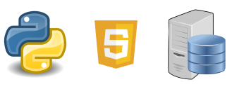

# Hello I'm Mikel

### I am a full-stack developer

My main goal is to **grow** and **learn** in order to be able to, one day, lead my own team and achieve our common dreams.

I spend a large part of my day learning new concepts to keep up to date. The more I understand about programming, the more I want to keep studying.

So far I have worked creating small pieces of code for simple websites and giving support to companies in relation to the security of SSH connections and the verification of their DB backups from the company where I have been working for a few months.

I am currently open to work and learn in everything related to:

- JavaScritp
- Python

In addition, I am attracted by the operation and management of databases and I am trying to implement them in the personal projects I am developing.

Right now, I am open to start a new adventure.